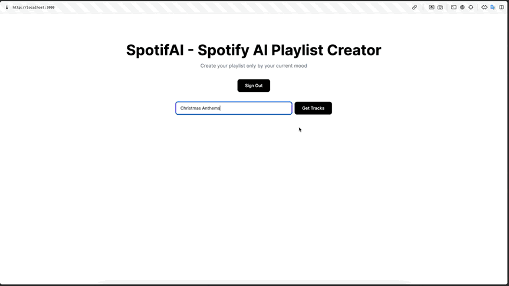

# SpotifAI - Spotify AI Playlist Creator

This application leverages AI (ChatGPT) and the Spotify API to create personalized playlists based on user input.

## Demo



## Setup

To run this application locally, follow these steps:

### Prerequisites

- Bun installed on your machine ([Download Bun](https://bun.sh/))
- A Supabase account for database management ([Sign up for Supabase](https://supabase.io/))
- A Spotify Developer account for API access ([Sign up for Spotify Developer](https://developer.spotify.com/))
- An OpenAI API key for accessing the ChatGPT ([Sign up for OpenAI API](https://openai.com/blog/openai-api))

### Installation

1. Clone the repository to your local machine:

```bash
git clone https://github.com/ArtyomShaitor/spotify-ai-playlist.git
```

2. Navigate to the project directory:

```bash
cd spotify-playlist-creator
```

3. Install dependencies using bun:

```bash
bun install
```

4. Create `.env.local` file in the root of the project

### Configuration

1. Set up Supabase:
   - Create a new Supabase project;
   - Set the environment variables `NEXT_PUBLIC_SUPABASE_URL` and `NEXT_PUBLIC_SUPABASE_ANON_KEY` with your project's URL and anonymous key, respectively.
2. Set up Spotify:
   - Create a new Spotify application in your Spotify Developer account;
   - Set the environment variables `SPOTIFY_CLIENT_ID` and `SPOTIFY_CLIENT_SECRET` with your application's client ID and client secret, respectively.
3. Set up OpenAI's GPT API:
   - Obtain an API key for the OpenAI API;
   - Set the environment variable `GPT_API_KEY` with your API key.

### Running the Application

1. Start the development server:

```bash
bun dev
```

2. Open your browser and navigate to http://localhost:3000 to access the application.

## Usage

1. On the homepage, input your preferences or prompts for the playlist.
2. Click on the "Generate" button to let the AI create a playlist recommendation.
